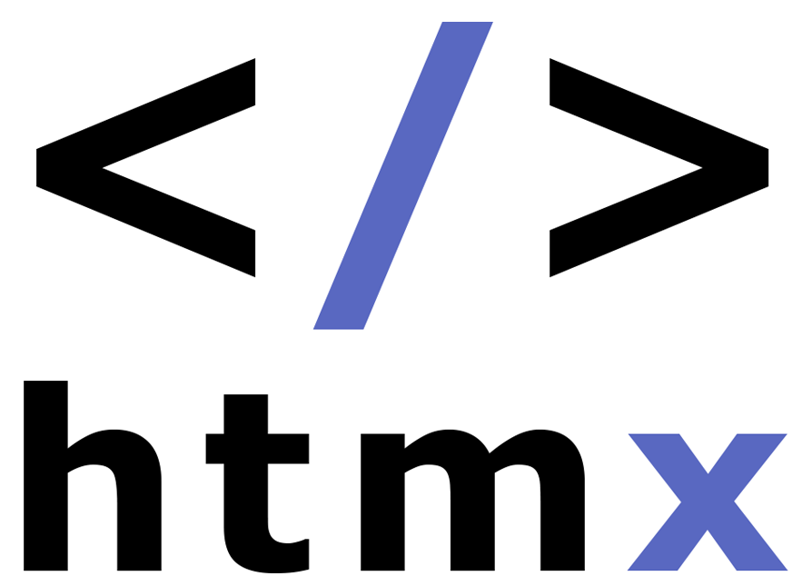

  &nbsp;  &nbsp;  &nbsp;  &nbsp;  &nbsp;

• 🎯 I’m interested in software development/design/architecture, books, films, and learning (always learning).

• 🤝 I’m looking to collaborate on anything interesting or challenging.

• 👨‍💻 I'm currently working on Leetcode problems and mastering the Linux terminal.

• 📨 Reach me at nathankennedy1@gmail.com or on any of the socials linked above.

## Must-have apps:
&nbsp;&nbsp;&nbsp;&nbsp;&nbsp;&nbsp;&nbsp;&nbsp;&nbsp;&nbsp;&nbsp;&nbsp;

## Technologies/IDE
&nbsp;&nbsp;&nbsp;&nbsp;&nbsp;&nbsp;&nbsp;&nbsp;&nbsp;&nbsp;&nbsp;&nbsp;&nbsp;&nbsp;

<!---
nathan-kennedy/nathan-kennedy is a ✨ special ✨ repository because its `README.md` (this file) appears on your GitHub profile.
You can click the Preview link to take a look at your changes.
--->
