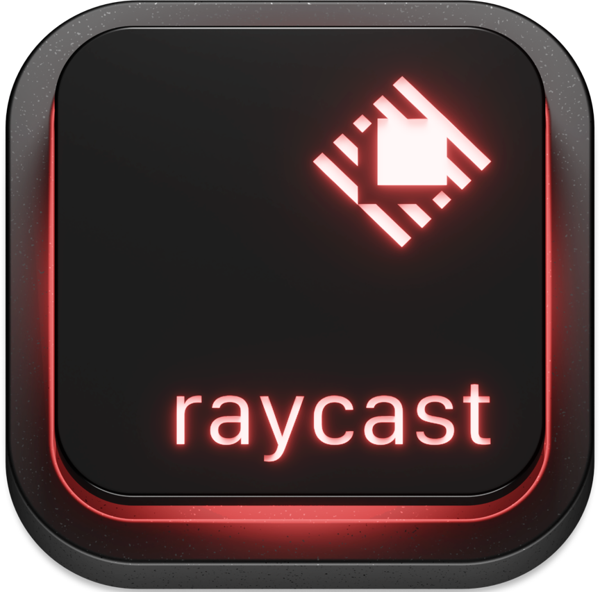

  

  

---

🎯 • I’m interested in software development/design/architecture, books, films, and learning (always learning).

🤝 • I’m looking to collaborate on anything interesting or challenging.

👨‍💻 • I'm currently working on DSA and mastering the Linux terminal.

📨 • Reach me at nathankennedy1@gmail.com or on any of my socials.

🔔 •   &nbsp;  &nbsp;  &nbsp;  &nbsp;  &nbsp;

 

## Technologies/IDE
&nbsp;&nbsp;&nbsp;&nbsp;&nbsp;&nbsp;&nbsp;&nbsp;&nbsp;&nbsp;&nbsp;&nbsp;&nbsp;&nbsp;&nbsp;&nbsp;&nbsp;&nbsp;&nbsp;&nbsp;&nbsp;&nbsp;&nbsp;&nbsp;&nbsp;&nbsp;&nbsp;&nbsp;&nbsp;&nbsp;&nbsp;&nbsp;&nbsp;&nbsp;&nbsp;&nbsp;htmx"/>

 

## Must-have apps:
&nbsp;&nbsp;&nbsp;&nbsp;&nbsp;&nbsp;&nbsp;&nbsp;&nbsp;&nbsp;&nbsp;&nbsp;&nbsp;&nbsp;&nbsp;&nbsp;&nbsp;&nbsp;&nbsp;&nbsp;&nbsp;&nbsp;&nbsp;&nbsp;&nbsp;&nbsp;&nbsp;&nbsp;&nbsp;&nbsp;&nbsp;&nbsp;&nbsp;&nbsp;&nbsp;&nbsp;

 

<!---
nathan-kennedy/nathan-kennedy is a ✨ special ✨ repository because its `README.md` (this file) appears on your GitHub profile.
You can click the Preview link to take a look at your changes.
--->
